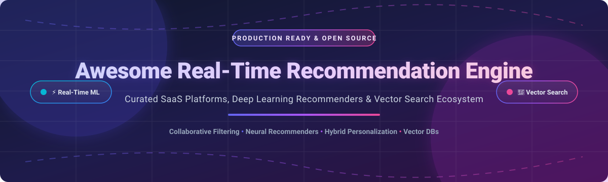

  

# 🚀 Awesome Real-Time Recommendation Engine

  
  
  
  
  

## 🌟 Top Real-Time Recommendation Engine Ecosystem & AI Personalization Infrastructure

**Curated List of Production SaaS Platforms, Open-Source Machine Learning Frameworks, Vector Databases & Collaborative Filtering Engines**  

*Focused on Real-Time Personalization, Neural Collaborative Filtering, Vector Search & Self-Hosted Recommenders*  

📅 **Last updated: October 2026**

---

### 📌 Overview & SEO Summary
Welcome to the definitive, high-performance guide to **Real-Time Recommendation Engines**, **AI Personalization Infrastructure**, and **Recommendation System Frameworks**. Whether you are building real-time e-commerce product recommendations, personalized streaming video feeds, vector similarity search systems, or neural collaborative filtering models, this repository provides comprehensive benchmarks, pricing structures, free tier limits, and GitHub star rankings for top industry tools.

**Category Leaders Included**: Amazon Personalize, Dynamic Yield, Algolia Recommend, Coveo Machine Learning, Recombee, Bloomreach Discovery, Crossing Minds, Segment Personas, Insider, and Nosto.

**Open-Source Infrastructure**: Production frameworks like **Elasticsearch**, **Meilisearch**, **Milvus**, **Qdrant**, **PyTorch Geometric**, **Weaviate**, **Chroma**, **DGL**, **OpenSearch**, **Apache PredictionIO**, **Gorse**, **RecBole**, **Implicit**, **Surprise**, **LightFM**, **TensorRec**, **Cornac**, **LensKit**, **NVIDIA Merlin**, and **Spotlight**.

---

## 📑 Table of Contents

- [🏢 SaaS / Hosted Personalization Platforms](#-saas--hosted-personalization-platforms)
- [💻 Open-Source Recommender Engines & Vector Search](#-open-source-recommender-engines--vector-search)
  - [Open-Source Ecosystem (Ranked by Star Count)](#open-source-ecosystem-ranked-by-star-count)
- [🤝 How to Contribute](#-how-to-contribute)
- [⚠️ Disclaimer & System Architecture Notes](#️-disclaimer--system-architecture-notes)
- [💖 Support & Sponsorship](#-support--sponsorship)
- [📈 Star History](#-star-history)

---

## 🏢 SaaS / Hosted Personalization Platforms

> 📊 **Market Overview**: The global recommendation engine market is estimated at **$9.3B–$14.5B in 2026** and projected to reach **$82B–$182B by 2034–2036** (CAGR ~28%–37%). The sector is **highly competitive and fragmented** across specialized vertical solutions, though underpinned by concentrated tech & cloud infrastructure giants.

| Platform | Key Features & Best Use Case | Starting Price | Free Tier / Trial Limits | Company Size (Valuation / Revenue) |
| :--- | :--- | :--- | :--- | :--- |
| **[Amazon Personalize](https://aws.amazon.com/personalize/)** | ⚡ Real-time ML personalization using Amazon.com technology. Best for AWS-native setups. | Pay-as-you-go (~$0.05/training hr, ~$0.20/GB data) | **2 months free**: 20 GB data processing/mo, 100 training hrs/mo, 180,000 recommendation requests/mo | **$2.7T+** (Parent: Amazon Web Services / Amazon Market Cap) |
| **[Segment Personas](https://segment.com/)** | 🎯 Customer data platform with unified profiles for personalized recommendations. Best for Segment users. | Team plan from **$120/month** (Business tier custom quoted) | **Free Forever**: Up to 1,000 Monthly Tracked Users (MTUs) and 2 sources | **$46.2B** (Parent: Twilio Inc. Market Cap; ~$5.57B ARR) |
| **[Dynamic Yield](https://www.dynamicyield.com/)** | 🛍️ Enterprise real-time personalization and optimization for e-commerce. Best for enterprise personalization. | Custom enterprise quotes (~$35,000/yr estimated entry level) | **No free tier**; enterprise sales demo / custom trial upon request | **$300M+** (Acquired by Mastercard; doubling ARR within Data & Services division) |
| **[Algolia Recommend](https://www.algolia.com/products/recommendations/)** | 🔍 AI-powered related product & trending suggestions. Best for Algolia search users. | Grow plan pay-as-you-go from **$0/mo** ($0.50 per 1k requests) | **Free Forever**: 5,000 recommendation requests/mo, 10k searches/mo, 50k records | **$2.25B** (Valuation; ~$100M ARR) |
| **[Bloomreach Discovery](https://www.bloomreach.com/)** | 🛒 AI-powered product discovery and commerce search recommendations. Best for retail personalization. | Enterprise custom quote (~$60,000/yr starting contract) | **No free tier**; enterprise demo and proof of concept on request | **$2.2B** (Valuation; $260M ARR) |
| **[Insider](https://insiderone.com/)** | 📈 AI-native customer engagement & growth management platform. Best for marketing personalization. | Enterprise custom subscription based on MTUs/channels | **No free tier**; enterprise demo available | **$2.0B** (Valuation; $150M ARR) |
| **[Coveo Machine Learning](https://www.coveo.com/)** | 🧠 AI-powered recommendation for enterprise search & content discovery. Best for enterprise search. | Enterprise custom quote based on query volume units | **No free tier**; 14-day to 30-day enterprise evaluation trial | **~$350M CAD** (Market Cap; ~$205M CAD annual revenue) |
| **[Nosto](https://www.nosto.com/)** | 🌐 Commerce experience platform with AI product recommendations. Best for e-commerce merchants. | Modular custom quotes (~$500–$5,000+/mo estimated by volume) | **No free tier**; structured Proof of Concept (PoC) available | **~$20M ARR** (Private VC-backed; $16M+ raised) |
| **[Crossing Minds](https://www.crossingminds.com/)** | 🔮 AI recommendations for e-commerce and media content discovery. Best for diverse ML needs. | Formerly enterprise quote (Acquired by OpenAI core team) | **No free tier**; enterprise demo was available | **~$3.9M ARR** (Acquired by OpenAI; $13.5M+ total funding raised) |
| **[Recombee](https://www.recombee.com/)** | 🛠️ Developer-friendly recommendation API with real-time ML algorithms. Best for developers. | Standard plan from **$99/month** | **Free Forever**: 100,000 recommendation requests/month (or 30-day unlimited trial) | **~$2.2M–$5.3M ARR** (Private unfunded / bootstrapped) |

---

## 💻 Open-Source Recommender Engines & Vector Search

Open-source frameworks provide self-hosted sovereignty, customizable collaborative filtering models, vector similarity indices, and deep learning algorithms for real-time recommendation engines.

### Open-Source Ecosystem (Ranked by Star Count)

Here are the top open-source projects ranked in **descending order by GitHub Star Count**:

1. **[Elasticsearch](https://github.com/elastic/elasticsearch)**  
     
   🔍 **Search and analytics engine**, SSPL/Elastic License with **78,200+ GitHub stars**. Provides search-based recommendation algorithms, vector search capabilities, and high-performance real-time query engines for enterprise scale.

2. **[Meilisearch](https://github.com/meilisearch/meilisearch)**  
     
   ⚡ **Fast & ultra-relevant search engine**, MIT licensed with **59,500+ GitHub stars**. Delivers instant typo-tolerant search and real-time candidate retrieval for application recommendations.

3. **[Milvus](https://github.com/milvus-io/milvus)**  
     
   ☁️ **Cloud-native vector database**, Apache-2.0 licensed with **46,300+ GitHub stars**. Engineered for billion-scale vector similarity search and high-throughput semantic recommendation engines.

4. **[Qdrant](https://github.com/qdrant/qdrant)**  
     
   🚀 **High-performance vector database & search engine**, Apache-2.0 licensed with **34,900+ GitHub stars**. Provides real-time vector similarity search with rich payload filtering for embedding-based recommendation architectures.

5. **[Chroma](https://github.com/chroma-core/chroma)**  
     
   🎨 **AI-native open-source embedding database**, Apache-2.0 licensed with **29,400+ GitHub stars**. Lightweight vector store optimized for LLM integration and semantic item-to-item recommendations.

6. **[Typesense](https://github.com/typesense/typesense)**  
     
   🎯 **Fast, typo-tolerant search engine**, GPL-3.0 licensed with **26,600+ GitHub stars**. Optimized for instant site search, faceted navigation, and search-based recommendation pipelines.

7. **[PyTorch Geometric (PyG)](https://github.com/pyg-team/pytorch_geometric)**  
     
   🕸️ **Graph Neural Network library for PyTorch**, MIT licensed with **24,100+ GitHub stars**. Powers state-of-the-art graph-based recommendation systems and link prediction tasks.

8. **[Microsoft Recommenders](https://github.com/recommenders-team/recommenders)**  
     
   📦 **Best practices & algorithms for recommendation systems**, MIT licensed with **21,900+ GitHub stars**. Includes examples, utilities, and benchmarking tools for collaborative filtering, SAR, SVD, VAE, and LightGCN.

9. **[Weaviate](https://github.com/weaviate/weaviate)**  
     
   🧩 **Open-source vector database**, BSD-3-Clause licensed with **16,800+ GitHub stars**. Enables multimodal vector recommendations and GraphQL-driven semantic search.

10. **[Deep Graph Library (DGL)](https://github.com/dmlc/dgl)**  
      
    📊 **Easy-to-use graph neural network framework**, Apache-2.0 licensed with **14,200+ GitHub stars**. Built for scalable graph neural network training, ideal for social graph and e-commerce recommender models.

11. **[OpenSearch](https://github.com/opensearch-project/OpenSearch)**  
      
    🔎 **Open-source search & analytics suite**, Apache-2.0 licensed with **13,800+ GitHub stars**. Community-driven search suite featuring k-NN vector search for real-time recommendation retrieval.

12. **[Apache PredictionIO](https://github.com/apache/predictionio)**  
      
    🏗️ **Machine learning server for developers**, Apache-2.0 licensed with **12,500+ GitHub stars**. Classic event server architecture to build and serve predictive recommendation engines.

13. **[Gorse](https://github.com/gorse-io/gorse)**  
      
    🐹 **Go-based open-source recommender system**, Apache-2.0 licensed with **9,800+ GitHub stars**. Offers automated model training, real-time recommendation APIs, collaborative filtering, matrix factorization, and an administrative dashboard.

14. **[Surprise](https://github.com/NicolasHug/Surprise)**  
      
    🐍 **Python scikit for recommender systems**, BSD-3-Clause licensed with **6,800+ GitHub stars**. Specializes in explicit rating collaborative filtering algorithms (SVD, KNN, NMF) with evaluation tools.

15. **[LightFM](https://github.com/lyst/lightfm)**  
      
    💡 **Hybrid recommendation algorithm in Python**, Apache-2.0 licensed with **5,100+ GitHub stars**. Combines collaborative filtering and content-based item/user metadata to solve cold-start problems.

16. **[RecBole](https://github.com/RUCAIBox/RecBole)**  
      
    📚 **Unified recommender system library built on PyTorch**, MIT licensed with **4,500+ GitHub stars**. Implements 80+ benchmarked recommendation algorithms across sequential, context-aware, and knowledge graph models.

17. **[Implicit](https://github.com/benfred/implicit)**  
      
    ⚡ **Fast collaborative filtering for implicit feedback datasets**, MIT licensed with **3,800+ GitHub stars**. GPU-accelerated ALS, BPR, and logistic matrix factorization algorithms.

18. **[Spotlight](https://github.com/maciejkula/spotlight)**  
      
    🔦 **PyTorch-based recommendation model framework**, MIT licensed with **3,000+ GitHub stars**. Features deep learning utility for explicit feedback, implicit feedback, and sequential user interaction recommendation models.

19. **[TensorRec](https://github.com/jfkirk/tensorrec)**  
      
    🧪 **TensorFlow recommendation engine framework**, Apache-2.0 licensed with **1,300+ GitHub stars**. Customizable neural network architectures for hybrid collaborative and content-based recommendation.

20. **[Cornac](https://github.com/PreferredAI/cornac)**  
      
    🌽 **Multimodal recommendation framework**, Apache-2.0 licensed with **1,000+ GitHub stars**. Multi-interest and multimodal recommender algorithms leveraging text, image, and network context.

21. **[LensKit](https://github.com/lenskit/lenskit)**  
      
    🔬 **Open-source recommender toolkit for Python**, MIT/Apache-2.0 licensed with **970+ GitHub stars**. Built for research, reproducible evaluation, and collaborative filtering algorithms.

22. **[NVIDIA Merlin](https://github.com/NVIDIA-Merlin/Merlin)**  
      
    🏎️ **GPU-accelerated recommender framework**, Apache-2.0 licensed with **900+ GitHub stars**. Accelerates end-to-end deep learning recommender pipelines (NVTabular, HugeCTR, Merlin Models) for high-throughput inference.

23. **[CaseRecommender](https://github.com/caserec/CaseRecommender)**  
      
    💼 **Python framework for recommender systems**, GPL-3.0 licensed with **500+ GitHub stars**. Flexible library for collaborative filtering, content-based recommendation, and hybrid experiment workflows.

---

### 💡 Architectural Recommendation Strategy
- **Production Web & Mobile Apps**: Combine **Gorse** for Go-based real-time recommendation serving with **Meilisearch** or **Typesense** for high-speed candidate retrieval.
- **Deep Learning & Enterprise Scale**: Deploy **NVIDIA Merlin** for GPU-accelerated neural training and **Milvus** / **Qdrant** for vector similarity serving.
- **Research, Experimentation & Benchmarking**: Use **Microsoft Recommenders**, **RecBole**, or **LensKit** for algorithm evaluation and offline backtesting.

---

## 🤝 How to Contribute

Contributions, bug reports, and pull requests are warmly welcomed!

1. 🍴 **Fork** the repository on GitHub.
2. 📝 **Add or edit** entries in `README.md` (maintain standard table and badge formatting).
3. 🔎 **Include details**: Name, homepage/repo link, 1–2 sentence description, stars, and licensing.
4. 🚀 **Submit a Pull Request** with a clear explanation of your additions.

Please review [Awesome-Awesome-Awesome](https://github.com/ishandutta2007/Awesome-Awesome-Awesome) for general guidelines.

---

## ⚠️ Disclaimer & System Architecture Notes

- **Community Curated**: This is a community-curated directory intended for educational and architectural reference.
- **Data Privacy & Governance**: Real-time recommendation systems process high-frequency user interaction telemetry (clicks, views, purchases). Ensure self-hosted implementations comply with GDPR, CCPA, and appropriate security controls.
- **Latency SLAs**: Low-latency real-time recommendations require optimized vector indices, feature store caching (e.g., Redis/Feast), and sub-50ms inference setups.
- **Cold Start Dynamics**: New users and items require hybrid approaches (content embeddings + metadata heuristics) alongside collaborative filtering.

---

## 💖 Support & Sponsorship

If you found this repository helpful for your machine learning engineering work, architectural research, or product selection, please consider supporting the project!

- ⭐ **Star** this repository on GitHub to help others discover it.
- 🔀 **Fork** and share it with your data science and engineering teams.
- ☕ **Buy me a coffee**: Show your appreciation and support ongoing open-source curation via the [GitHub Sponsor Dashboard](https://github.com/sponsors/ishandutta2007).

---

## 📈 Star History

---

  <b>Made with ❤️ for ML engineers, personalization teams, and open-source practitioners.</b> 
  <i>Let's make real-time recommendation engines transparent, scalable, and open!</i>

